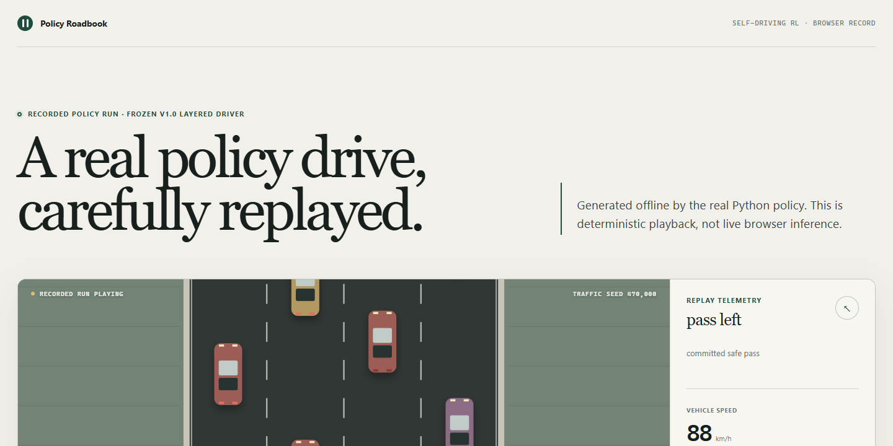
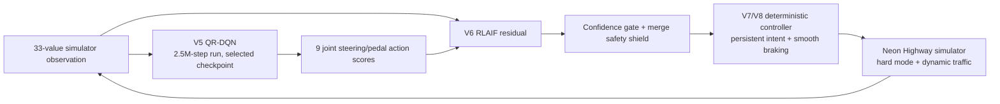

# Self-Driving RL

**A simulator-only reinforcement-learning driver that learns to pass traffic,
manage speed, and finish hard routes without sacrificing safety.**

<p align="center">
  
</p>

<p align="center">
  <a href="https://becauseno7.github.io/Self-Driving-RL/"><strong>Open the Policy Roadbook browser replay (deployment pending)</strong></a>
</p>
· [Five-minute setup](#five-minute-setup)
· [Measured results](#measured-v10-result)
· [How it works](#recommended-v10-driver)
· [Learning guides](#learn-the-project)

> [!IMPORTANT]
> Self-Driving RL controls a small, custom Python simulator. It has not been
> trained or validated for a real vehicle, a robotics platform, a public road,
> or any safety-critical use.

The v1.0 release candidate freezes a layered driver rather than presenting the
latest experiment as automatically best. A validation-selected V5 QR-DQN
checkpoint proposes joint steering/pedal actions, a V6 preference residual
makes sparse confidence-gated corrections, and deterministic V7/V8 controller
code supplies persistent speed intent, smooth braking, merge checks, and
dynamic-traffic handling.

## Measured v1.0 result

The recommended driver was evaluated on 100 previously unused, 45-second
hard-mode routes with dynamic traffic, beginning at seed `690000`.

| Metric | Result |
|---|---:|
| Routes completed | **100 / 100 (100%)** |
| Crashes | **0 / 100 (0%)** |
| Mean net passes per route | **8.43** |
| Safe passing opportunities answered | **90.2%** |
| Clear-road deep-slowdown steps | **0.04%** |

These are measurements of one deterministic simulator configuration and seed
range, not a real-world safety claim. The complete recorded output is packaged
as `release/huggingface/evaluation/v8-braking-final-unseen-100.json`.

## Five-minute setup

Python 3.11 or 3.12 is required. You can run the simulator immediately; the
recommended trained driver additionally needs the two pending model artifacts
described in [Install the frozen models](#install-the-frozen-models).

### Windows (PowerShell + `uv`)

```powershell
git clone https://github.com/becauseno7/Self-Driving-RL.git
Set-Location Self-Driving-RL
powershell -ExecutionPolicy ByPass -c "irm https://astral.sh/uv/install.ps1 | iex"
uv sync --extra dev
uv run sdr-game random --episodes 1 --difficulty hard
```

The repository's `uv` configuration selects PyTorch's CUDA 12.6 wheel for the
original Windows/Linux training workstation. Inference still defaults to CPU;
an NVIDIA GPU is not required to watch the driver.

### Cross-platform (standard `venv` + `pip`)

This path intentionally uses the platform wheel from PyPI instead of the
workstation-specific `uv` CUDA index.

```bash
git clone https://github.com/becauseno7/Self-Driving-RL.git
cd Self-Driving-RL
python3 -m venv .venv
source .venv/bin/activate
python -m pip install --upgrade pip
python -m pip install -e ".[dev]"
sdr-game random --episodes 1 --difficulty hard
```

On Windows `cmd.exe`, activate with `.venv\Scripts\activate.bat`. On Windows
PowerShell, use `.venv\Scripts\Activate.ps1`.

Run the development checks with either `uv run pytest` / `uv run ruff check .`
or `python -m pytest` / `python -m ruff check .`.

## Install the frozen models

The model repository and release URLs have **not been published yet**. Do not
paste the placeholders below into a script. After the user approves a model
license and the artifacts are uploaded, replace all three pending values:

```powershell
$BaseModelUrl = "<PENDING_BASE_MODEL_DOWNLOAD_URL>"
$OverrideModelUrl = "<PENDING_OVERRIDE_MODEL_DOWNLOAD_URL>"
New-Item -ItemType Directory -Force models
Invoke-WebRequest $BaseModelUrl -OutFile models\model.zip
Invoke-WebRequest $OverrideModelUrl -OutFile models\override_model.pt
```

Release builders can instead use the hash-verified local staging copies in
`release/huggingface/`. Before loading either file, verify it:

```powershell
Get-FileHash models\model.zip -Algorithm SHA256
Get-FileHash models\override_model.pt -Algorithm SHA256
```

| Artifact | Bytes | SHA-256 |
|---|---:|---|
| `model.zip` | 3,594,202 | `5780BBEE5CE2009459F3AA796AA4982FBF33222DCC182883D31AFAA16C597039` |
| `override_model.pt` | 35,439 | `06C3A0CEE04AAF6B8822781FE78F867F513A3019EBBF7FD8D91E10F117146BEC` |

Stable-Baselines3 model archives can contain cloudpickle data. Load only files
you trust, and verify the published checksum first. The V6 override is loaded
with PyTorch's weights-only mode, but its checksum should still be verified.

## Watch the recommended driver

After placing the two artifacts under `models/`, this is the actual v1.0
PowerShell command—not the plain QR-DQN viewer:

```powershell
uv run sdr-rlaif watch `
  --base-model models/model.zip `
  --override-model models/override_model.pt `
  --longitudinal-intent --dynamic-traffic `
  --difficulty hard --device cpu --episodes 10
```

The equivalent POSIX command is:

```bash
sdr-rlaif watch \
  --base-model models/model.zip \
  --override-model models/override_model.pt \
  --longitudinal-intent --dynamic-traffic \
  --difficulty hard --device cpu --episodes 10
```

Add `--endless` for one continuous drive that restarts only after a crash.
Without the published weights, `sdr-game random` remains a complete visual
smoke test, but it is not the trained driver.

Reproduce the final evaluation after installing the models:

```powershell
uv run sdr-rlaif override-evaluate `
  --base-model models/model.zip `
  --override-model models/override_model.pt `
  --longitudinal-intent --dynamic-traffic `
  --difficulty hard --device cpu `
  --episodes 100 --seed 690000
```

## Recommended v1.0 driver



- **Observation:** 33 normalized values: nine ego/route values plus six
  readings for each of four lanes.
- **Action:** `Discrete(9)`, the Cartesian product of left/keep/right steering
  and brake/coast/gas pedal intent.
- **Learned base:** QR-DQN from `sb3-contrib`, trained for 2.5 million steps
  with eight mirrored hard-mode environments; the validation-selected
  `model.zip` is used, not the riskier final live checkpoint.
- **Preference layer:** a small V6 residual trained from ranked matched
  trajectories. Confidence thresholds and an independent safety shield limit
  when it can replace the frozen base action.
- **Deterministic layer:** V7/V8 controller code persists passing intent,
  reacts to speed-matched slow leaders, meters target-speed changes, and
  separates comfort braking from emergency braking.

The action indices are:

| | Brake | Coast | Gas |
|---|---:|---:|---:|
| Left | 0 | 1 | 2 |
| Keep | 3 | 4 | 5 |
| Right | 6 | 7 | 8 |

### Why DAgger is not in the recommended driver

V8 also introduced a human DAgger teaching workflow. The evaluated DAgger
candidates failed their matched-seed promotion gates—one materially regressed
net passing, while an earlier candidate also regressed braking and lane
quality. They were **rejected** and are **not loaded by the recommended v1.0
driver**. The final 100-route result above uses the frozen V5/V6 artifacts plus
deterministic controller code only. DAgger remains a documented research path,
not a release dependency.

## Browser replay

The browser experience is a deterministic replay exported from a trajectory
produced by the real frozen Python policy. It is useful for inspecting a
representative drive without installing Python, but it does **not** run PyTorch
or make live policy decisions in the visitor's browser. The GitHub Pages URL is
a placeholder until deployment is approved:
[becauseno7.github.io/Self-Driving-RL](https://becauseno7.github.io/Self-Driving-RL/).

To preview the exact static site locally before publication:

```bash
python -m http.server 8000 --directory web
```

Then open `http://127.0.0.1:8000`. No Python package or model download is
needed for replay; the three exported routes and their provenance ship inside
`web/data/`.

## Learn the project

The project is intentionally readable as a learning story. Start with the
[RL primer](docs/rl-primer.md), then use the focused guides below rather than
reverse-engineering the whole codebase:

| Topic | Guide |
|---|---|
| Simulator, telemetry, and first learning loop | [V1](docs/neon-highway-v1.md) |
| Target-speed control | [V2](docs/neon-highway-v2.md) |
| Hard-mode scenario design and 360° sensing | [V3](docs/neon-highway-v3.md) |
| Physics corrections, 33 observations, 9 actions, QR-DQN | [V4](docs/neon-highway-v4.md) |
| Passing objective and 2.5M-step V5 run | [V5](docs/neon-highway-v5.md) |
| Preference learning and the V6 guarded residual | [V6](docs/neon-highway-v6-rlaif.md) |
| Human teaching, gates, and rejected DAgger candidates | [V8](docs/neon-highway-v8-dagger.md) |
| Release artifact provenance and verification | [Release artifacts](docs/release-artifacts.md) |

The arc matters: early policies exposed reward-horizon and simulator-physics
bugs; later policies learned safe route completion but waited behind traffic;
V5 made passing measurable; V6 reduced indecision; V7/V8 controller work fixed
slow-leader and braking behavior. Failed fine-tunes and DAgger candidates are
kept visible so model selection is evidence-led rather than chronological.

## Training and experiment outputs

Training writes generated data below `runs/`, which is intentionally ignored by
Git. A game run includes its configuration, validation history, selected and
last checkpoints, evaluation metrics, monitor log, and TensorBoard events.

The reference V5 training command and full hyperparameters are recorded in the
[V5 guide](docs/neon-highway-v5.md). V6 preference collection, reward fitting,
residual training, calibration, and held-out comparison are in the
[V6 guide](docs/neon-highway-v6-rlaif.md). Use fixed, previously unused seed
ranges and report crashes alongside return—never select a driver from one
rendered episode.

## Limitations

- Neon Highway is a simplified top-down kinematics simulator, not CARLA and
  not a vehicle dynamics, perception, or robotics stack.
- The policy consumes structured simulator state. It does not process camera,
  lidar, GPS, maps, weather, pedestrians, signage, or hardware faults.
- The final claim covers 100 deterministic hard/dynamic seeds and a 45-second
  route. Longer routes, alternate distributions, and real traffic are outside
  that evidence.
- Dynamic traffic follows authored rules; other agents do not model the full
  variety or adversarial behavior of human drivers.
- Model artifacts must be treated as trusted executable-adjacent data because
  the Stable-Baselines3 archive format uses cloudpickle.

## Project policies

See [CONTRIBUTING.md](CONTRIBUTING.md) for development and experiment
expectations, [SECURITY.md](SECURITY.md) for private vulnerability reporting,
and [CITATION.cff](CITATION.cff) for citation metadata.

The public code/model license is still pending user approval. No permission
should be inferred from the absence of a `LICENSE` file.
